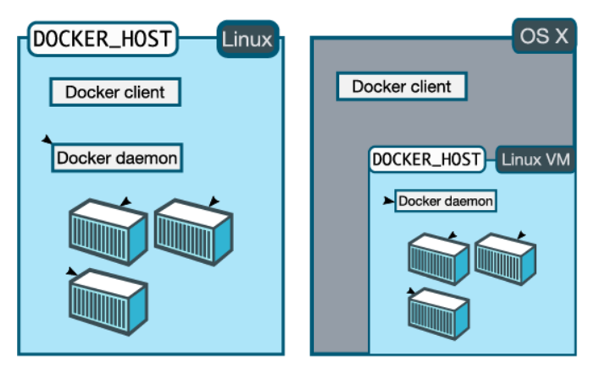

# Docker Setup


Docker CE(이하 docker)는 설치환경 및 목적에 따라 서로 다른 설치방법이 있습니다. 

예로써 아래 그림을 참고해서 보면 Docker는 Docker Client / Daemon 구조로 되어 있어(Docker daemon을 dockerd로 병행해서 쓰입니다.) Mac 및 Window 상에서 Docker를 설치 할 경우, Docker Client는 Host OS(Windows, Mac)에 설치되고 가상Linux서버를 생성해 Docker daemon이 설치되며, Linux에 설치하는 경우에는 Docker client, daemon이 동일한 Host(Linux)에 설치됩니다. 



이 문서는

- Linux에 Docker를 설치하는 가이드이며 Virtual Machine에 설치된 Ubuntu 18.04 LTS에 Docker를 설치합니다. 
- Kubernetes 실습을 위해 Kubernetes에서 지원되는 Docker의 특정 버전(18.06.0 ubuntu)을 설치하기 위한 방법을 가이드합니다.

개략적인 설치순서는 아래와 같습니다.

1. Kubernetes xx 버전의 지원대상 Docker 선정
2. Ubuntu에 Docker  Repository  추가
3. 추가된 Repository로부터 Docker 버전 조회
4. 설치가능한 Docker 설치


# Docker CE for Ubuntu 18.04(LTS)

## Requirements

### Host OS

Docker는 Linux Container기술을 기반으로 동작하기 때문에 Docker가 동작하는 Docker Host는 Linux이여야 합니다.  이 문서는 Host OS로써 Ubuntu 18.04(LTS)를 설치했다는 가정하에 작성되었습니다. 일부 설치 및 셋팅 방법에 있어 Linux 커널에 따라 상이한 방법이 존재하니 주의하시기 바랍니다.


### 설치계정

root계정으로 설치 및 구성합니다.

아래와 같이 root 계정으로 로그인합니다.

```bash
ubuntu@node:~$ su root
Password: root
root@node0:/home/ubuntu# cd /
root@node0:/# 
```


### Uninstall docker

우리가 설치하고자하는 Docker의 Version은 docker-ce 18.06.0입니다. 만약 다른 버전이 설치되어 있다면 아래 명령어로 설치된 docker를 삭제 후 진행하도록합시다.

```bash
# docker version
Client:
 Version:           18.09.2
 API version:       1.39
 Go version:        go1.10.6
 Git commit:        6247962
 Built:             Sun Feb 10 04:13:47 2019
 OS/Arch:           linux/amd64
 Experimental:      false

Server: Docker Engine - Community
 Engine:
  Version:          18.09.2
  API version:      1.39 (minimum version 1.12)
  Go version:       go1.10.6
  Git commit:       6247962
  Built:            Sun Feb 10 03:42:13 2019
  OS/Arch:          linux/amd64
  Experimental:     false

# apt-get purge -y docker-ce
# apt-get autoremove -y --purge docker-ce

# rm -rf /var/lib/docker
# groupdel docker
```


### Proxy 셋팅

시스템 환경변수 파일에 Proxy 설정

```bash
## 환경변수 파일에 Proxy정보를 추가합니다.
# vi /etc/environment
http_proxy="http://70.10.15.10:8080/"
https_proxy="http://70.10.15.10:8080/"
ftp_proxy="http://70.10.15.10:8080/"
no_proxy="localhost,127.0.0.1,182.193.17.192,sds.redii.net"
HTTP_PROXY="http://70.10.15.10:8080/"
HTTPS_PROXY="http://70.10.15.10:8080/"
FTP_PROXY="http://70.10.15.10:8080/"
NO_PROXY="localhost,127.0.0.1,182.193.17.192,sds.redii.net"
```


apt-get 및 Update Manager를 위한 Proxy 설정

```bash
# apt-get 및 Update Manager를 위한 Proxy 설정
# vi /etc/apt/apt.conf.d/95proxies
Acquire::http::proxy "http://70.10.15.10:8080/";    
Acquire::ftp::proxy "ftp://70.10.15.10:8080/";   
Acquire::https::proxy "http://70.10.15.10:8080/";
```

신규로 등록한 환경변수를 로딩하기 위해 터미널을 새로 열고 root로 로그인합니다.


### 인증서셋팅

```bash
# 인증서 셋팅
# vi /usr/local/share/ca-certificates/SDS.crt
-----BEGIN CERTIFICATE-----
MIIDUjCCArugAwIBAgIJAKzaAATW//aZMA0GCSqGSIb3DQEBBQUAMHoxCzAJBgNV
BAYTAktSMQ4wDAYDVQQIEwVTZW91bDETMBEGA1UEBxMKR2FuZ21hbi1ndTEUMBIG
A1UEChMLU0FNU1VORyBTRFMxDDAKBgNVBAMTA1NEUzEiMCAGCSqGSIb3DQEJARYT
aW5mb3NlY0BzYW1zdW5nLmNvbTAeFw0xMjExMDkwNzU5MDVaFw0zNzExMDMwNzU5
MDVaMHoxCzAJBgNVBAYTAktSMQ4wDAYDVQQIEwVTZW91bDETMBEGA1UEBxMKR2Fu
Z21hbi1ndTEUMBIGA1UEChMLU0FNU1VORyBTRFMxDDAKBgNVBAMTA1NEUzEiMCAG
CSqGSIb3DQEJARYTaW5mb3NlY0BzYW1zdW5nLmNvbTCBnzANBgkqhkiG9w0BAQEF
AAOBjQAwgYkCgYEA0tOlHychBr2wXOTNgV59JyetRMVGihI09+ABEsqz/4KLAuJA
qxIM+MZkOPPjemM/otGD1tnz/Fw1s/PHHrC5NAWrfawSQd/DvWuKFWaZMZL7IsZ/
Wmg5qdLITLeXeZv79uiDsUSCK1HlddZRUebxHX2dveDgQ4FnpEWgmK4D1gUCAwEA
AaOB3zCB3DAdBgNVHQ4EFgQUnMyf8r+sQIWkIFYiXMhTmXNAw+cwgawGA1UdIwSB
pDCBoYAUnMyf8r+sQIWkIFYiXMhTmXNAw+ehfqR8MHoxCzAJBgNVBAYTAktSMQ4w
DAYDVQQIEwVTZW91bDETMBEGA1UEBxMKR2FuZ21hbi1ndTEUMBIGA1UEChMLU0FN
U1VORyBTRFMxDDAKBgNVBAMTA1NEUzEiMCAGCSqGSIb3DQEJARYTaW5mb3NlY0Bz
YW1zdW5nLmNvbYIJAKzaAATW//aZMAwGA1UdEwQFMAMBAf8wDQYJKoZIhvcNAQEF
BQADgYEAbbBmxjw88hM5FSFhcM+qoXlzignpECU0dO3bjdf2qkuQfAGDkXRdfNv9
1wL9Qi683S6YshowEKngQoK8UTVwtGylWt5dGNAyc8t+S7QSAwDPgJp2L0wEGwCb
GmbeNpJ3res+KW5xIIZt1YMi73sTlRwtKl5Lksa1kskUKVUfp80=
-----END CERTIFICATE-----
```

```bash
# update-ca-certificates
```


## Install Docker CE

Docker를 설치하는 방법은 아래와 같이 3가지로 구분되어질 수 있는데, 여기서는 일반적으로 권장되는 설치 방법으로 Ubuntu에 Docker Repository를 추가해 docker를 설치하도록하겠습니다. 그 이외의 설치방법은 docker 공식문서를 참조바랍니다.

- Set up Docker's repositories : 일반적이고 권장되는 설치방법으로 Docker Repository를 추가해 설치하는 방법입니다. 이러한 방법은 사용자들에게 Docker의 설치와 업그레이드를 용이하게 할 수 있습니다.
- Install manually : 인터넷의 연결이 제한적인 환경하에서 설치되는 방법으로 DEB package를 다운로드 받아 수동으로 설치하는 방법입니다.
- convenience scripts : 사전에 작성된 스크립트를 수행해 자동으로 간편하게 Docker를 설치하는 방법입니다.


### Install using the repository

Host에 docker를 설치하기 위한 사전과정으로 Docker repository를 Ubuntu에 추가하는 과정입니다. 

#### SET UP THE REPOSITORY

1. apt-get update 명령어를 통해 최신의 소프트웨어 package를 Update합니다.

   ```bash
   # apt-get update
   ```

2. 설치에 필요한 소프트웨어를 설치합니다.

   ```bash
   # apt-get install \
       apt-transport-https \
       ca-certificates \
       curl \
       gnupg-agent \
       software-properties-common
   ```

3. Docker의 공식 GPG를 다운로드 받아 추가합니다.

   ```bash
   # curl -fsSL https://download.docker.com/linux/ubuntu/gpg | sudo apt-key add -
   ```

4. Stable 저장소를 추가합니다.

   ```bash
   # add-apt-repository \
      "deb [arch=amd64] https://download.docker.com/linux/ubuntu \
      $(lsb_release -cs) \
      stable"
   ```


#### INSTALL DOCKER CE

Kubernetes에서 지원되는 Docker 버전을 설치하기 위해 18.06.0 ubuntu버전의 docker를 설치하는 과정입니다.

1. apt-get update 명령어를 통해 최신의 소프트웨어 package를 Update합니다.

   ```bash
   # apt-get update
   ```

2. 특정버전의 Docker CE를 설치하기 위해 설치가능한 Docker를 리스트한 후 해당 리스트에서 설치가능한 Version으로 설치하는 과정입니다.

   a. 설치가능 Version조회:

   ```bash
   # apt-cache madison docker-ce
   
     docker-ce | 5:18.09.1~3-0~ubuntu-xenial |  docker-ce | 5:18.09.1~3-0~ubuntu-bionic | https://download.docker.com/linux/ubuntu bionic/stable amd64 Packages
    docker-ce | 5:18.09.0~3-0~ubuntu-bionic | https://download.docker.com/linux/ubuntu bionic/stable amd64 Packages
    docker-ce | 18.06.1~ce~3-0~ubuntu | https://download.docker.com/linux/ubuntu bionic/stable amd64 Packages
    docker-ce | 18.06.0~ce~3-0~ubuntu | https://download.docker.com/linux/ubuntu bionic/stable amd64 Packages
    docker-ce | 18.03.1~ce~3-0~ubuntu | https://download.docker.com/linux/ubuntu bionic/stable amd64 Packages
   
   ```

   b. 18.06.0 ubuntu버전의 docker를 설치합니다.

   ```bash
   # apt-get install docker-ce=18.06.0~ce~3-0~ubuntu
   ```

   c. docker version 명령어로 설치된 docker version을 확인합니다.

   ```bash
   root@ubuntu:/# docker version
   Client:
    Version:           18.06.0-ce
    API version:       1.38
    Go version:        go1.10.3
    Git commit:        0ffa825
    Built:             Wed Jul 18 19:09:54 2018
    OS/Arch:           linux/amd64
    Experimental:      false
   
   Server:
    Engine:
     Version:          18.06.0-ce
     API version:      1.38 (minimum version 1.12)
     Go version:       go1.10.3
     Git commit:       0ffa825
     Built:            Wed Jul 18 19:07:56 2018
     OS/Arch:          linux/amd64
     Experimental:     false
   ```

   18.06.0-ce 버전의 Docker CE가 설치된 것었을을 확인할 수 있고, Docker CE는 Client와 Server역할을 하는 Engine으로 구성되어 있음을 알 수 있습니다.

3. Proxy 설정

   

   Docker의 Proxy설정은 Docker 크게 4부분으로 나누어 생각해 볼 수 있습니다.

   - ① Host / User 환경변수 설정
   - ② Docker Client -> Network -> Docker Daemon
   - ③ Docker Daemon -> Network -> 외부Endpoint
   - ④ Docker Container -> Network -> 외부Endpoint

   통상 Linux의 Proxy설정은 Host의 환경변수, 사용자의 환경변수, 애플리케이션의 서비스 설정이 고려되지만, Docker의 Container는 격리된 또다른 네트워크환경을 제공하기 때문에 추가적으로 동일하게 Container안에서의 Host의 환경변수, 사용자의 환경변수, 애플리케이션의 서비스 설정이 고려되어져야 합니다.

   이러한 어려움때문에 Docker에서는 Docker Container -> Network -> 외부Endpoint 의 Proxy설정을 용이하게하기위해 `~/.docker/config.json` 로 Container의 Proxy를 셋팅해둘 수 있습니다.

   **① Host / User 환경변수 설정**

   시스템 환경변수에 Proxy를 설정하는 과정은 이미 위에서 다루었으므로 반영되었는지 여부만 확인해보도록하겠습니다.

   ```bash
   # env | grep proxy
   https_proxy=http://70.10.15.10:8080/
   http_proxy=http://70.10.15.10:8080/
   no_proxy=localhost,127.0.0.1,182.193.17.192,sds.redii.net
   ftp_proxy=http://70.10.15.10:8080/
   ```

   **③ Docker 서비스 Proxy 설정(Docker Daemon -> Network -> 외부Endpoint)**

   ```bash
   # mkdir -p /etc/systemd/system/docker.service.d
   # vi /etc/systemd/system/docker.service.d/http-proxy.conf
   [Service]
   Environment="HTTP_PROXY=http://70.10.15.10:8080/" "NO_PROXY=localhost,127.0.0.1,182.193.17.192,sds.redii.net"
   ```

   ```bash
   # vi /etc/systemd/system/docker.service.d/https-proxy.conf
   [Service]
   Environment="HTTP_PROXY=http://70.10.15.10:8080/" "NO_PROXY=localhost,127.0.0.1,182.193.17.192,sds.redii.net"
   ```

   

   **④ Docker Container Proxy설정(Docker Container -> Network -> 외부Endpoint)**

   Docker는 17.07버전을 전후로 기동된 Container 안에서 Proxy를 설정하는 방법에 차이가 존재합니다. 해당 내용은 Docker 공식 문서에서 확인 할 수 있으며, 여기서는 Docker 18.06을 설치하였으므로 해당 버전에 대한 Docker client에 Proxy를 설정하도록 하겠습니다.

   ```bash
   # cd $HOME
   # mkdir -p ~/.docker
   ```

   ```bash
   # vi ~/.docker/config.json
   
   {
    "proxies":
    {
      "default":
      {
        "httpProxy": "http://70.10.15.10:8080/",
        "httpsProxy": "http://70.10.15.10:8080/",
        "noProxy": "localhost,127.0.0.1,182.193.17.192,http://sds.redii.net"
      }
    }
   }
   ```

   Docker 재시작

   ```bash
   # systemctl daemon-reload
   # systemctl restart docker
   ```

   

4. 정상적으로 설치 및 설정되었는지 확인하기 위해 아래 두가지를 확인해보겠습니다.

   - Docker daemon proxy 설정확인
   - Docker 정상기동 및 Container proxy 설정 확인

   

   **Docker daemon proxy 설정확인**

   docker info 명령어로 설치정보 및 Proxy 설정 정보를 확인합니다.

   ```bash
   # docker info
   Containers: 3
    Running: 0
    Paused: 0
    Stopped: 3
   Images: 1
   Server Version: 18.06.0-ce
   ...
   HTTP Proxy: http://70.10.15.10:8080/
   No Proxy: localhost,127.0.0.1,182.193.17.192,sds.redii.net
   Registry: https://index.docker.io/v1/
   Labels:
   Experimental: false
   Insecure Registries:
    127.0.0.0/8
   Live Restore Enabled: false
   ```

   

   **Docker 정상기동 및 Container proxy 설정 확인**

   `docker run` 명령어를 통해 `ubuntu`이미지를 실행해 환경변수를 출력합니다. 정상적으로 설치가 되었다면 아래와 같이 Docker가 실행되고 Container Proxy정보가 출력되는 것을 확인 할 수 있습니다.

   ```bash
   # docker run ubuntu env
   Unable to find image 'ubuntu:latest' locally
   latest: Pulling from library/ubuntu
   6cf436f81810: Pull complete 
   987088a85b96: Pull complete 
   b4624b3efe06: Pull complete 
   d42beb8ded59: Pull complete 
   Digest: sha256:7a47ccc3bbe8a451b500d2b53104868b46d60ee8f5b35a24b41a86077c650210
   Status: Downloaded newer image for ubuntu:latest
   PATH=/usr/local/sbin:/usr/local/bin:/usr/sbin:/usr/bin:/sbin:/bin
   HOSTNAME=4f26102a5f15
   no_proxy=localhost,127.0.0.1,182.193.17.192,sds.redii.net
   HTTP_PROXY=http://70.10.15.10:8080/
   http_proxy=http://70.10.15.10:8080/
   HTTPS_PROXY=https://70.10.15.10:8080/
   https_proxy=https://70.10.15.10:8080/
   NO_PROXY=localhost,127.0.0.1,182.193.17,sds.redii.net
   HOME=/root
   ```


# 사내Registry ReDii 접속하기

Docker Registry는 Docker의 이미지 저장소로써 운영환경에 따라 아래와 같이 3종류의 Registry를 사용할 수 있습니다.

- public으로 운영되는 Docker Hub
- 사내에서 운영되는 Redii
- 로컬서버에 설치해 사용할 수 있는 Private Local Registry

여기서 사내에서 운영되는 Redii를 사용하기위한 사전준비 내용에 대해 알아보도록하겠습니다.


## ReDii 회원가입

Redii사이트에 접속한 후 가이드에 따라 회원가입절차를 완료합니다.

- ReDii : https://sds.redii.net:8443
- 회원가입가이드 : https://sds.redii.net:8443/help/registryguide


## Docker login

```bash
# docker login sds.redii.net
Username: ReDii ID 입력
Password: ReDii Password 입력
```

